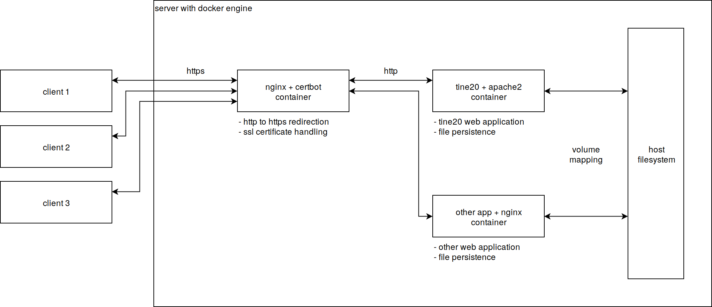

# docker-app: tine20 -- issue - extra reverse proxy

## To reproduce the issue with hostname "localhost" (problem occurring in Firefox), perform the following steps:

1. Setup Ubuntu Bionic Desktop (minimal installation) in a virtual machine
2. Install system updates and git   
   1. `sudo apt-get update`  
   2. `sudo apt-get dist-upgrade`
   3. `sudo apt-get install git`
3. Reboot the VM (and maybe create a snapshot here)
4. Clone this repository with this branch checked out  
   `git clone https://github.com/talsen-team/docker-app--tine20.git --recurse-submodules --branch=issue--tine20-extra-reverse-proxy`
5. Install additional dependencies and perform required modifications to the system  
   `sudo /bin/bash docker-app--tine20/install-dependencies.sh`
6. After the script finishes open the clone repository with VS Code  
   `code docker-app--tine20`
7. Perform the VS Code task `docker-compose--compose--up`  
   This task will pull required docker images and create required docker containers and networks.  
   Use either the VS Code UI  
   1. Press Ctrl + Shift + P
   2. Type `Run Task` and select `Tasks: Run Task`
   3. Press Enter
   4. Select the task `docker-compose--compose--up`
   5. Press enter again 
   6. Confirm the fullscreen prompt with your password, **Or** use the terminal:  
   1. Change to the cloned directory  
      `cd docker-app--tine20`
   2. Run the task manually  
      `/bin/bash bash-util/elevate.sh root bash-commands/docker-compose--compose--up.sh . default.docker-compose`
   3. Confirm the fullscreen prompt with your password
8. Wait until the images are pulled and both containers are started
9. Wait until the nginx container has finished starting, after the file `volumes/server-nginx-certbot/cache/dhparams.pem` wait 2 moe seconds and the container is ready
10. Perform the VS Code task `nginx--update-configuration`
    This task will create the nginx configuration which performs the http to https redirection using locally generated self-signed certificates.
    Use either the VS Code UI  
    1. Press Ctrl + Shift + P
    2. Type `Run Task` and select `Tasks: Run Task`
    3. Press Enter
    4. Select the task `nginx--update-configuration`
    5. Press enter again 
    6. Confirm the fullscreen prompt with your password, **Or** use the terminal:  
    1. Change to the cloned directory  
       `cd docker-app--tine20`
    2. Run the task manually  
       `/bin/bash bash-util/elevate.sh root bash-commands--custom/nginx--update-configuration.sh . default.docker-compose application`
    3. Confirm the fullscreen prompt with your password
11. Perform the VS Code task `chromium--open-application-url`
    This task will tell Chromium to open the url https://localhost.
    Use either the VS Code UI  
    1. Press Ctrl + Shift + P
    2. Type `Run Task` and select `Tasks: Run Task`
    3. Press Enter
    4. Select the task `chromium--open-application-url`
    5. Press enter again 
    6. Confirm the fullscreen prompt with your password, **Or** use the terminal:  
    1. Change to the cloned directory  
       `cd docker-app--tine20`
    2. Run the task manually  
       `/bin/bash bash-util/elevate.sh ${USER} bash-commands--custom/chromium--open-application-url.sh . default.docker-compose`
12. Now Chromium is open and showing the url https://localhost, prompting you trying to access unsecure web content (due to self-signed certificates). Tell Chromium to show the content anyway.
    1. Click on `Advanced`
    2. Then click on `Proceed to localhost (unsafe)`
13. Now the tine20 login page is visible, log in with the pre-defined credentials (defined in [container.env](container.env)).
    - user: `admin`
    - pass: `secureadminpassword`
14. Now the more-or-less working version of http to https redirection has been performed. If the same page is opened with Firefox, the login page is stuck loading forever.
15. Perform the VS Code task `browser--open-application-url`
    This task will tell the default web browser (Firefox) to open the url https://localhost.
    Use either the VS Code UI  
    1. Press Ctrl + Shift + P
    2. Type `Run Task` and select `Tasks: Run Task`
    3. Press Enter
    4. Select the task `browser--open-application-url`
    5. Press enter again 
    6. Confirm the fullscreen prompt with your password, **Or** use the terminal:  
    1. Change to the cloned directory  
       `cd docker-app--tine20`
    2. Run the task manually  
       `/bin/bash bash-util/elevate.sh ${USER} bash-commands/browser--open-application-url.sh . default.docker-compose`
16. Now Firefox is open and showing the url https://localhost, prompting you trying to access unsecure web content (due to self-signed certificates). Tell Firefox to show the content anyway.
    1. Click on `Advanced`
    2. Then click on `Add Exception...`
    3. Uncheck option `Permanently store this exception`
    4. Click on `Confirm Security Exception`
17. Now the tine20 login page is stuck loading (for unknown reason).

The used nginx configuration can be found [here](https://github.com/talsen-team/docker-nginx-certbot/blob/master/docker/server-nginx-certbot/rootfs/templates/vhost.template.conf).
To view the *live* file execute the following commands:

1. Attach to the nginx container  
   `sudo docker exec -it server-nginx-certbot /bin/bash`
2. Install nano  
   `apk add nano`
3. Change to the nginx vhost directory  
   `cd /etc/nginx/vhosts/`
4. Open the tine20 configuration  
   `nano localhost.conf`

The configuration can be viewed and edited directly inside the container.
To apply changes to nginx perform the following command:

1. Attach to the nginx container  
   `sudo docker exec -it server-nginx-certbot /bin/bash`
2. Reload nginx configuration
   `nginx -s reload`  
   The warnings regardng `ssl_stapling` can be ignored (they come from the self-signed certificates)

## To reproduce the issue with hostname "tine.private" (problem occurring in both Chromium and Firefox), perform the following steps:

Do the same steps as described [above](#to-reproduce-the-issue-with-hostname-localhost-problem-occurring-in-firefox-perform-the-following-steps) until step 10 inclusive.

11. Change the value of the variable `HOST_SERVICE_URL` in your [host.env](host.env) file to `http://tine.private`.
12. Change the value of the variable `ENV_SERVER_NAME` in your [container.env](container.env) file to `tine.private`
13. If you have the containers up and running from the above example, perform the VS Code task `docker-compose--compose--down`
    This task will stop and remove running containers and used docker networks.
    Use either the VS Code UI  
    1. Press Ctrl + Shift + P
    2. Type `Run Task` and select `Tasks: Run Task`
    3. Press Enter
    4. Select the task `docker-compose--compose--down`
    5. Press enter again 
    6. Confirm the fullscreen prompt with your password, **Or** use the terminal:  
    1. Change to the cloned directory  
       `cd docker-app--tine20`
    2. Run the task manually  
       `/bin/bash bash-util/elevate.sh root bash-commands/docker-compose--compose--down.sh . default.docker-compose`
    3. Confirm the fullscreen prompt with your password
14. If you have a volumes directory (leftovers from the above example), perform the VS Code task `docker-compose--volumes--wipe-local`
    This task will wipe the locally mapped volumes and restore a default environment for the containers to be created next.
    Use either the VS Code UI  
    1. Press Ctrl + Shift + P
    2. Type `Run Task` and select `Tasks: Run Task`
    3. Press Enter
    4. Select the task `docker-compose--volumes--wipe-local`
    5. Press enter again 
    6. Confirm the fullscreen prompt with your password, **Or** use the terminal:  
    1. Change to the cloned directory  
       `cd docker-app--tine20`
    2. Run the task manually  
       `/bin/bash bash-util/elevate.sh root bash-commands/docker-compose--volumes--wipe-local.sh . default.docker-compose`
    3. Confirm the fullscreen prompt with your password
15. Continue with step 7 from the section [above](#to-reproduce-the-issue-with-hostname-localhost-problem-occurring-in-firefox-perform-the-following-steps)
16. Now both Chromium and Firefox should be both stuck on the tine20 login page (for unknown reason).

## use your custom nginx configuration for experimenting

To use your custom nginx configuration for the locally provided domains `localhost` and `tine.private` perform the following steps:
1. Create the manual nginx configuration directory  
   `sudo mkdir -p volumes/server-nginx-certbot/manual-config/`
2. Create your custom configuration for domain name `localhost`  
   `sudo gedit volumes/server-nginx-certbot/manual-config/localhost.conf`
3. Paste your content into the text editor gedit and save the file.
4. Create a link for the domain `tine.private`  
   `$( cd volumes/server-nginx-certbot/manual-config/ && sudo ln -fs localhost.conf tine.private.conf )`
5. Reload the nginx configuration  
   1. If the nginx container is already running perform the VS Code task `nginx--update-configuration`.  
      This task will create the nginx configuration which performs the http to https   redirection using locally generated self-signed certificates.
      Use either the VS Code UI  
      1. Press Ctrl + Shift + P
      2. Type `Run Task` and select `Tasks: Run Task`
      3. Press Enter
      4. Select the task `nginx--update-configuration`
      5. Press enter again 
      6. Confirm the fullscreen prompt with your password, **Or** use the terminal:  
      1. Change to the cloned directory  
       `cd docker-app--tine20`
      2. Run the task manually  
         `/bin/bash bash-util/elevate.sh root bash-commands--custom/nginx--update-configuration.sh . default.docker-compose application`
      3. Confirm the fullscreen prompt with your password
   2. **Or** create the containers and start with step 7. of [the steps from above](#to-reproduce-the-issue-with-hostname-localhost-problem-occurring-in-firefox-perform-the-following-steps)
6. After executing the VS Code task `nginx--update-configuration` you should see the following messages in the VS Code terminal:  
   `...
   Rendering vhost configuration for 'localhost' from '/manual-config/localhost.conf'.
   ...
   Rendering vhost configuration for 'tine.private' from '/manual-config/tine.private.conf'.
   ...`

   If you see instead the following output:

   `...
   Rendering vhost configuration for 'tine.private' from '/templates/vhost.template.conf'.
   ...`  
   in the output the custom configuration was not used (double check if the above steps were done correctly).

## use your custom apache2 configuration for experimenting

To use your custom apache2 configuration perform the following steps:
1. Uncomment the build configuration in the docker-compose file for docker service server--tine20.  
   Open your [docker-compose/server--tine20/default.docker-compose](docker-compose/server--tine20/default.docker-compose) file, uncommment lines 20 - 22 and save the file
2. Adjust your local apache2 configuration for the tine20 container  
   Open your [docker/server--tine20/rootfs/templates/apache2.conf](docker/server--tine20/rootfs/templates/apache2.conf) file, adjust the configuration as you desire and save the file
3. Build the tine20 docker image locally by performing the VS Code task `docker-compose--image--renbuild`
    This task will rebuild all configured docker images in the docker compose configuration without using the build cache.
    Use either the VS Code UI  
    1. Press Ctrl + Shift + P
    2. Type `Run Task` and select `Tasks: Run Task`
    3. Press Enter
    4. Select the task `docker-compose--image--renbuild`
    5. Press enter again 
    6. Confirm the fullscreen prompt with your password, **Or** use the terminal:  
    1. Change to the cloned directory  
       `cd docker-app--tine20`
    2. Run the task manually  
       `/bin/bash bash-util/elevate.sh root bash-commands/docker-compose--image--rebuild.sh . default.docker-compose`
    3. Confirm the fullscreen prompt with your password
4. Wait until the (re-)build has finished and then recreate the docker containers by continuing at step 7. of the steps described [above](#to-reproduce-the-issue-with-hostname-localhost-problem-occurring-in-firefox-perform-the-following-steps)
5. Each time you ajust the apache template file, just rebuild the image again, afterwards recreate the docker containers and finally do not forget to reload the nginx configuration

## the desired infrastructure setup visualized

